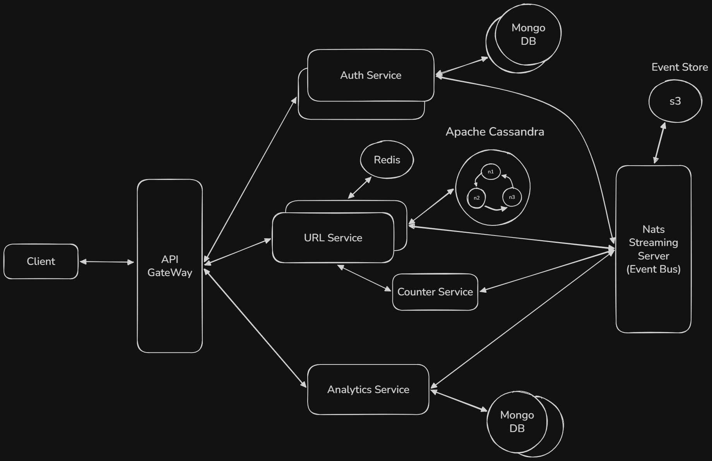

# URL Shortener Architecture

## Architecture Design

---

## Overview
This system is designed as a microservices-based URL shortener with scalability, fault tolerance, and asynchronous processing in mind. It uses an API Gateway, multiple services, distributed storage, caching, and an event-driven architecture.

---

## High-Level Flow

1. Client sends request to API Gateway  
2. API Gateway routes request to appropriate service  
3. Services communicate with databases and event bus  
4. Asynchronous processing handled via event streaming  
5. Cached responses served for high performance  

---

## Components

### 1. API Gateway
- Single entry point for all requests
- Routes traffic to:
  - Auth Service
  - URL Service
  - Analytics Service
- Handles request validation and routing

---

### 2. Auth Service
- Manages user authentication and authorization
- Stores user data in MongoDB
- Publishes `UserCreated` events to event bus

---

### 3. URL Service
- Core service of the system
- Responsibilities:
  - Generate short URLs
  - Handle redirection

#### Short URL Generation Strategy
- Does **not** generate IDs independently to avoid collisions
- Requests a **batch (range)** of IDs (e.g., 1000–2000) from Counter Service
- Uses a **bijective function (e.g., Base62 encoding)** on the counter value to generate short URLs
- Each instance works on its assigned range → ensures:
  - No collisions
  - No coordination between instances
  - High throughput

#### Storage
- Cassandra → primary DB (URL mappings)
- Redis → cache for hot URLs

#### Events
- Publishes:
  - `URLCreated`
  - `URLAccessed`

---

### 4. Counter Service
- Responsible for **unique ID generation**
- Allocates **ID ranges (batches)** to URL Service instances
  - Example: Instance A → 1–1000, Instance B → 1001–2000
- Ensures:
  - No overlap between instances
  - Distributed ID generation
- Can use atomic counters or sequence management internally
- Reduces contention and avoids central bottleneck

---

### 5. Analytics Service
- Processes user behavior and click analytics
- Consumes events from event bus
- Stores aggregated data in MongoDB

---

### 6. Event Bus (NATS Streaming)
- Enables asynchronous communication
- Decouples services
- Handles:
  - URL events
  - User events
  - Click events

---

### 7. Event Store (S3)
- Stores event logs for replay and debugging
- Helps in rebuilding state if needed

---

### 8. Databases

#### Cassandra
- Used by URL Service
- Distributed, highly scalable
- Stores URL mappings

#### MongoDB
- Used by:
  - Auth Service
  - Analytics Service
- Stores user and analytics data

#### Redis
- Used by URL Service
- Caches frequently accessed URLs
- Reduces database load

---

## Request Flows

### 1. Create Short URL
1. Client → API Gateway  
2. API Gateway → Auth Service (validate user)  
3. API Gateway → URL Service  
4. URL Service:
   - Requests ID batch from Counter Service (if not available)
   - Picks next ID from its range
   - Converts ID → short URL using bijective function (Base62)
   - Stores mapping in Cassandra
   - Caches in Redis
   - Publishes `URLCreated` event  
5. Event consumed by Analytics & Counter services  

---

### 2. Redirect Short URL
1. Client → API Gateway  
2. API Gateway → URL Service  
3. URL Service:
   - Checks Redis cache  
   - If miss → fetch from Cassandra  
   - Returns original URL  
   - Publishes `URLAccessed` event  
4. Counter & Analytics updated asynchronously  

---

### 3. Analytics Processing
1. Events received from event bus  
2. Analytics Service processes data  
3. Stores results in MongoDB  

---

## Key Design Decisions

- **Batch ID Allocation** → reduces contention and improves scalability  
- **Bijective Encoding (Base62)** → compact, unique, collision-free short URLs  
- **Microservices Architecture** → independent scaling  
- **Event-Driven System** → loose coupling, async processing  
- **Cassandra** → high write throughput  
- **Redis Cache** → low latency reads  
- **NATS Streaming** → reliable event delivery  
- **S3 Event Store** → durability and replay capability  

---

## Benefits

- No ID collisions
- Horizontally scalable URL generation
- Low latency redirects
- Reduced database load via caching
- Fully asynchronous analytics pipeline
- Fault-tolerant and extensible system

---